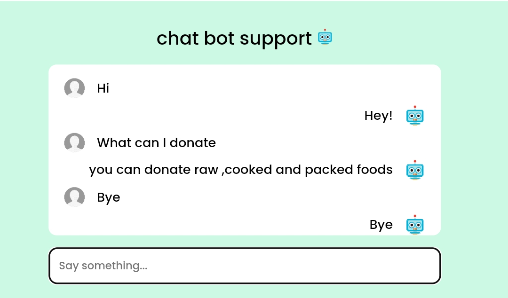

# Food Waste Management System
<!--  -->

The Food Waste Management System is designed to collect excess/leftover food from donors such as hotels, restaurants, marriage halls, and individuals and distribute it to people in need. This project aims to reduce food waste and support those who lack access to sufficient food.

## Tools and Technologies
<ul>
  <li>Frontend: HTML, CSS, JavaScript</li>
  <li>Backend: PHP</li>
  <li>Web Server: XAMPP</li>
  <li>Database: MySQL</li>
</ul>

## System Modules
The system is divided into three modules:
<ul>
  <li>User</li>
  <li>Admin</li>
  <li>Delivery</li>
</ul>

### User Module

The User module allows individuals or businesses (such as marriage halls, restaurants, or anyone with excess food) to register, log in, and donate food. Users can specify the type and quantity of food, and the system matches the donation with nearby people or organizations in need. Users can also view their past donations. The donation information is sent to the Admin module for further processing.

### Admin Module

The Admin module is used by NGOs, charities, and trusts registered on the platform. Admins manage the donations by receiving information from the User module and listing available donations for organizations to select from. Admins can view and manage donations, track requests, and assign pickups to the Delivery module. They oversee the entire food distribution process, ensuring that donations are delivered to the right organizations.

### Delivery Person Module

The Delivery module is for individuals who wish to contribute by picking up and delivering food donations. Delivery personnel can register on the platform, view donation requests, and handle pickup and drop-off services. The module shows both pickup and drop-off locations for the donations, facilitating efficient delivery.

Overall, the Food Waste Management System ensures that excess food is collected and distributed efficiently, minimizing waste while helping those in need. The User module handles donations, the Admin module manages distribution, and the Delivery module ensures timely deliveries.

## Screenshots
<h3>User Module</h3>
<!--  -->

<h3>Admin Module</h3>

<h3>Delivery Module</h3>

## Features
<ul>
  <li>Mobile-friendly responsive design</li>
  <li>Chatbot support for assistance</li>
  <li>Secure login with encryption</li>
</ul>

<h2>Mobile-Friendly Design</h2>

<h2>Chatbot Support</h2>

<h2>Secure Login</h2>

## How to Run
To run this project locally, follow these steps:
<ol>
  <li>Download the project ZIP file.</li>
  <li>Extract the files and copy the folder.</li>
  <li>Paste the folder inside your root directory (for XAMPP: `xampp/htdocs`, for WAMP: `wamp/www`, for LAMP: `var/www/html`).</li>
  <li>Open PHPMyAdmin (`http://localhost/phpmyadmin`).</li>
  <li>Create a new database.</li>
  <li>Import the `demo.sql` file (located in the database folder).</li>
  <li>Run the script by navigating to `http://localhost/folderName`.</li>
</ol>

## View Project
<a href="https://your-github-link-here" target="_blank">View Demo</a>
